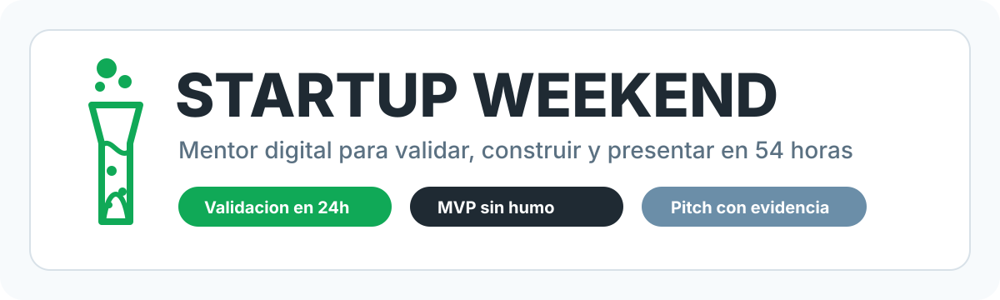

# Startup Weekend Mentor



Mentor digital interactivo para equipos que compiten en Startup Weekend. Esta metodologia convierte las 54 horas del evento en un sistema de decisiones, validacion, construccion y pitch.

No es una guia pasiva. Es un copiloto de trabajo: pregunta, desafia, facilita debates, corta discusiones largas, genera outputs concretos y obliga al equipo a validar con evidencia real antes de enamorarse de la solucion.

Funciona en Claude Code, ChatGPT, Claude.ai, Gemini, Cursor, Windsurf y cualquier LLM que acepte instrucciones de sistema.

Si tu equipo no es tecnico, tambien sirve. Puedes usarlo copiando el prompt en ChatGPT o Claude y escribiendo frases normales como:

```text
Estamos en sabado, tenemos una idea pero no sabemos si la gente pagaria.
Ayudanos a validar rapido.
```

El mentor responde con preguntas simples, pasos concretos y plantillas listas para usar.

---

## Que Es Startup Weekend

Startup Weekend es un evento global impulsado por Techstars donde personas de perfiles distintos forman equipos y construyen una startup desde cero en un fin de semana.

El formato clasico dura 54 horas, aunque cada ciudad, universidad, comunidad u organizador puede mover horarios, mentorias o presentaciones:

- **Viernes:** pitch de ideas, votacion, formacion de equipos y primer acuerdo de trabajo.
- **Sabado:** validacion con clientes reales, mentorias, decisiones de pivot y MVP.
- **Domingo:** demo, modelo de negocio, pitch final y preguntas de jueces.

El orden puede variar. Algunos eventos validan desde el viernes, otros hacen mentorias mas temprano, otros piden deck antes del domingo o cambian la hora de presentacion. Este framework no depende de un horario rigido: detecta en que momento esta el equipo y recomienda el siguiente paso mas importante.

La promesa del evento es simple: vivir el ciclo completo de una startup en tiempo comprimido. En lugar de hablar durante semanas sobre una idea, el equipo tiene que salir, aprender, construir, presentar y defender decisiones con evidencia.

---

## La Diferencia Crucial

Startup Weekend no es un hackathon tradicional.

En un hackathon comun, muchas veces gana quien construye la demo mas impresionante. En Startup Weekend, una demo bonita sin clientes puede perder contra una solucion mas simple con validacion fuerte.

La pregunta no es:

> "Que tan cool es lo que construimos?"

La pregunta real es:

> "Que aprendimos del mercado y que evidencia demuestra que esto podria ser un negocio?"

Por eso este mentor esta construido alrededor de una regla:

**Una opinion positiva no valida. Una accion observable si.**

Ejemplos de evidencia que si pesa:

- Un usuario cuenta una historia reciente del problema
- Ya usa un workaround manual
- Cuantifica cuanto le cuesta el problema
- Deja email o telefono
- Da un referido
- Agenda una demo o piloto
- Firma una carta de intencion
- Acepta probarlo con fecha
- Paga o preordena

---

## Las Primeras 24 Horas Definen Todo

En Startup Weekend, las primeras 24 horas son el filtro brutal.

Para el sabado al mediodia, el equipo deberia saber:

- Quien es el cliente real
- Que problema duele de verdad
- Como lo resuelve hoy
- Cuanto le cuesta
- Si esta dispuesto a hacer algo mas que decir "suena interesante"
- Que MVP minimo demuestra la propuesta de valor
- Que debe quedar fuera del scope

Si el equipo no valida en las primeras 24 horas, el resto del evento se vuelve teatro: mucho trabajo, poca evidencia.

Este framework fuerza un ciclo rapido:

```
HIPOTESIS → EXPERIMENTO → EVIDENCIA → DECISION → MVP → PITCH
```

Y si la evidencia es debil:

```
NO construir app completa.
Hacer otro experimento, landing, Figma, concierge MVP o pivot.
```

---

## Que Hace Este Mentor

La mayoria de recursos de Startup Weekend te dicen que hacer. Este mentor pregunta por que eso tiene sentido y como lo van a probar antes de gastar horas construyendo.

Siempre muestra la etapa actual:

```
━━━━━━━━━━━━━━━━━━━━━━━━━━━━━━━
 STARTUP WEEKEND · ETAPA 2/3
 Validacion y Desarrollo · Sabado
━━━━━━━━━━━━━━━━━━━━━━━━━━━━━━━
```

Opera en 5 modos:

| Modo | Cuando | Que hace |
|------|--------|----------|
| **DESCUBRIR** | El problema no esta claro | Pipeline socratico hasta causa raiz, cliente real e hipotesis |
| **VALIDAR RAPIDO** | Necesitan evidencia ya | Test Card, experimento de 30-90 min y scoring de evidencia |
| **DEBATIR** | El equipo esta atascado | Protocolo de 10 minutos para decidir y seguir |
| **CONSTRUIR** | Necesitan un output | Pitch, canvas, MVP, deck, Q&A, brief de mentorias |
| **REVISAR** | Quieren saber si estan listos | Auditoria por checklist de etapa |

---

## Validacion Rapida

El modulo central es `validar-rapido`.

Genera un experimento de 30-90 minutos:

```md
HIPOTESIS CRITICA:
Creemos que [cliente especifico] tiene [problema] y hara [accion observable].

EXPERIMENTO MAS RAPIDO:
En los proximos [30/60/90] minutos vamos a [accion concreta].

METRICA:
Mediremos [comportamiento observable], no opiniones.

UMBRAL DE EXITO:
Seguimos si [N de M] hacen [accion] antes de [hora].

DECISION SI FALLA:
Pivotar segmento, problema, solucion, modelo o scope.
```

Scoring de evidencia:

| Evidencia | Puntos |
|-----------|--------|
| "Suena interesante" | 1 |
| Historia reciente del problema | 2 |
| Workaround actual | 3 |
| Costo cuantificado | 4 |
| Email o telefono | 5 |
| Referido | 6 |
| Demo o piloto agendado | 7 |
| Carta de intencion | 8 |
| Piloto con fecha | 9 |
| Pago o preorden | 10 |

Con menos de 15 puntos, el mentor no recomienda construir una app completa.

---

## Las 3 Etapas del Evento

> Nota: este es el flujo mas comun. Puede variar segun la agenda local, la vertical del evento, el numero de equipos, la disponibilidad de mentores y los criterios de jueces.

### Etapa 1 — Viernes: Ideacion y Formacion

El viernes no se gana construyendo. Se gana saliendo con claridad.

Lo importante del viernes:

- Entender el formato y las reglas del evento
- Presentar ideas en pitch de 60 segundos
- Votar o elegir ideas con potencial
- Formar equipos balanceados: negocio, diseno, tecnologia, ventas, operaciones
- Acordar quien toma decisiones cuando haya desacuerdo
- Escribir la hipotesis del problema en una frase
- Definir a que usuarios se entrevistara primero
- Preparar el primer Test Card para validar el sabado

Al final del viernes, el equipo deberia poder decir:

```text
Creemos que [cliente especifico] tiene [problema concreto].
Sabremos que es cierto cuando [senal medible].
```

### Etapa 2 — Sabado: Validacion y Desarrollo

El sabado es el dia mas importante. El error tipico es ponerse a construir desde temprano sin saber si el problema existe.

Lo importante del sabado:

- Salir a hablar con usuarios reales
- Hacer preguntas sobre comportamiento, no sobre opiniones
- Validar problema, solucion, pago y canal
- Medir evidencia con scoring
- Decidir si pivotar o perseverar
- Recortar el MVP a un solo flujo demostrable
- Usar mentorias con preguntas especificas
- Preparar un primer borrador del pitch

El sabado no busca perfeccion. Busca evidencia.

Si nadie confirma el problema, se pivota. Si hay interes pero nadie se compromete, se cambia el experimento. Si hay evidencia fuerte, se construye el flujo core.

Al final del sabado, el equipo deberia tener:

- Entrevistas o pruebas documentadas
- Puntaje de evidencia
- Decision clara de pivot o perseverar
- MVP o prototipo que demuestre la propuesta de valor
- Lean Canvas con que esta validado y que sigue siendo hipotesis

### Etapa 3 — Domingo: Pitch Final

El domingo no es para descubrir el negocio desde cero. Es para contar con claridad lo que aprendieron y demostrar que el equipo puede ejecutar.

Lo importante del domingo:

- Ordenar el pitch de 5 minutos
- Preparar un deck simple
- Ensayar con cronometro
- Probar la demo varias veces
- Tener backup tecnico
- Preparar respuestas para jueces
- Explicar usuario, comprador, precio, mercado, competencia y primeros 100 clientes
- Mostrar la evidencia mas fuerte, no solo decir "hicimos entrevistas"

El mejor pitch no es el mas largo ni el mas bonito. Es el que explica:

```text
Problema real.
Cliente claro.
Evidencia concreta.
Solucion simple.
Modelo entendible.
Equipo capaz.
Siguiente paso.
```

---

## Como Usarlo Si No Eres Tecnico

No necesitas instalar nada para empezar.

Opcion simple:

1. Abre ChatGPT, Claude o Gemini.
2. Copia el contenido de `prompts/universal-system-prompt.md`.
3. Pegalo como instrucciones o al inicio de una conversacion.
4. Escribe en lenguaje normal que esta pasando.

Ejemplos:

```text
Es viernes y quiero preparar mi pitch de 60 segundos.
```

```text
Somos 5 en el equipo, es sabado y no sabemos a quien entrevistar.
```

```text
Hicimos 8 entrevistas. 5 dijeron que tienen el problema, pero nadie pagaria.
Que hacemos?
```

```text
Es domingo. Tenemos MVP, pero el pitch esta desordenado.
Ayudanos a prepararlo para jueces.
```

El mentor te va a responder con:

- Preguntas concretas
- Plantillas rellenables
- Checklists
- Scripts de entrevista
- Decisiones recomendadas
- Pitch y deck estructurados

---

## Instalacion Rapida

### Claude Code

```bash
git clone https://github.com/israads/startup-weekend-metodologia.git \
  ~/.claude/skills/startup-weekend
```

Luego:

```bash
claude /startup-weekend
```

### ChatGPT, Claude.ai, Gemini, Cursor o Windsurf

- ChatGPT Custom GPT: usar `prompts/chatgpt-custom-gpt.md`
- Claude.ai Project: usar `prompts/claude-project-instructions.md`
- Gemini u otro LLM: usar `prompts/universal-system-prompt.md`
- Cursor/Windsurf: usar `prompts/cursor-rules.md` o `.windsurfrules`

Ver [INSTALL.md](INSTALL.md) para instrucciones detalladas.

---

## Uso Durante el Evento

**Viernes noche**

```bash
/startup-weekend comenzar
/startup-weekend descubrir
/startup-weekend pitch1
```

**Sabado manana**

```bash
/startup-weekend validar-rapido
/startup-weekend script
/startup-weekend evidencias
```

**Sabado tarde**

```bash
/startup-weekend debatir "pivot o perseverar"
/startup-weekend mvp
/startup-weekend canvas
```

**Domingo**

```bash
/startup-weekend pitch5
/startup-weekend deck
/startup-weekend jueces
/startup-weekend revisar
```

---

## Comandos Principales

| Comando | Resultado |
|---------|-----------|
| `/startup-weekend comenzar` | Onboarding del evento, equipo, etapa y bloqueador |
| `/startup-weekend continuar` | Retoma la sesion desde archivos en `sesion/` |
| `/startup-weekend progreso` | Tracker de progreso |
| `/startup-weekend descubrir` | Motor de descubrimiento del problema |
| `/startup-weekend validar-rapido` | Test Card + experimento de 30-90 min |
| `/startup-weekend evidencias` | Learning Card + scoring acumulado |
| `/startup-weekend debatir` | Protocolo de decision de 10 minutos |
| `/startup-weekend duda` | Respuestas a situaciones comunes del evento |
| `/startup-weekend pitch1` | Pitch de 60 segundos |
| `/startup-weekend pitch5` | Pitch final de 5 minutos |
| `/startup-weekend mvp` | Especificacion del MVP |
| `/startup-weekend canvas` | Lean Canvas completo |
| `/startup-weekend deck` | Deck slide por slide |
| `/startup-weekend jueces` | Q&A preparado para jueces |
| `/startup-weekend revisar` | Auditoria de calidad |

---

## Estructura

```text
startup-weekend-metodologia/
├── assets/
│   └── startup-weekend-mentor-banner.svg
├── SKILL.md
├── INSTALL.md
├── README.md
├── LICENSE
├── .windsurfrules
├── prompts/
│   ├── universal-system-prompt.md
│   ├── chatgpt-custom-gpt.md
│   ├── claude-project-instructions.md
│   └── cursor-rules.md
└── references/
    ├── mentor-mode.md
    ├── descubrimiento-problema.md
    ├── validacion-rapida.md
    ├── debate-facilitator.md
    ├── faq-situaciones.md
    ├── etapa1-ideacion.md
    ├── etapa2-validacion.md
    ├── etapa3-presentacion.md
    ├── vmost-framework.md
    └── herramientas-canvas.md
```

---

## Fuentes Metodologicas

- [Techstars Startup Weekend](https://www.techstars.com/communities/startup-weekend/organize-a-startup-weekend/overview/about-startup-weekend): formato de 3 dias / 54 horas, pitch, MVP, mentoria y presentacion final.
- [Strategyzer Test Card](https://www.strategyzer.com/library/validate-your-ideas-with-the-test-card): hipotesis, test, metrica y umbral antes de experimentar.
- [Strategyzer Learning Card](https://www.strategyzer.com/library/capture-customer-insights-and-actions-with-the-learning-card): observacion, aprendizaje, decision y siguiente accion.
- [Customer Development / get out of the building](https://kromatic.com/blog/startup-weekend-lesson-learned-2-customer-development/): hablar con clientes reales antes de construir en aislamiento.

---

## Licencia

MIT. Usalo, adaptalo y compartelo.
